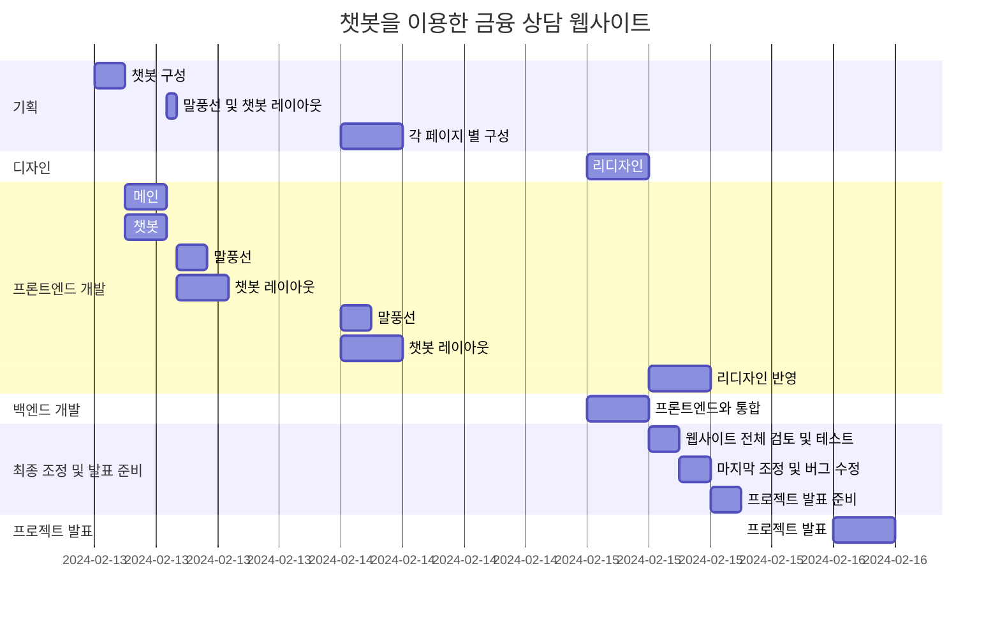

# orm-project1

- 챗봇을 이용한 금융 상담 프로그램

### 4.1 개발 일정(WBS)
* 아래 일정표는 머메이드로 작성했습니다.

```mermaid
gantt
    dateFormat  YYYY-MM-DD
    title       챗봇을 이용한 금융 상담 웹사이트

    section 기획
    챗봇 구성                         :          des1, 2024-02-13, 3h
    말풍선 및 챗봇 레이아웃             :         des2, after des7, 1h
    각 페이지 별 구성                :         des3, 2024-02-14, 6h

    section 디자인
    리디자인                         :          des4, 2024-02-15, 6h

    section 프론트엔드 개발
    메인                             :         des7, after des1, 4h
    챗봇                             :         des8, after des1, 4h
    말풍선                           :         des9, after des2, 3h
    챗봇 레이아웃                     :         des10, after des2, 5h
    말풍선                           :         des11, 2024-02-14, 3h
    챗봇 레이아웃                     :         des12, 2024-02-14, 6h
    리디자인 반영                     :         des13, after des4, 6h

    section 백엔드 개발
    프론트엔드와 통합                 :          des13, 2024-02-15, 6h

    section 최종 조정 및 발표 준비
    웹사이트 전체 검토 및 테스트      :         des14, after des13, 3h
    마지막 조정 및 버그 수정          :         des15, after des14, 3h
    프로젝트 발표 준비                :         des16, after des15, 3h

    section 프로젝트 발표
    프로젝트 발표                     :         des17, 2024-02-16, 6h
```