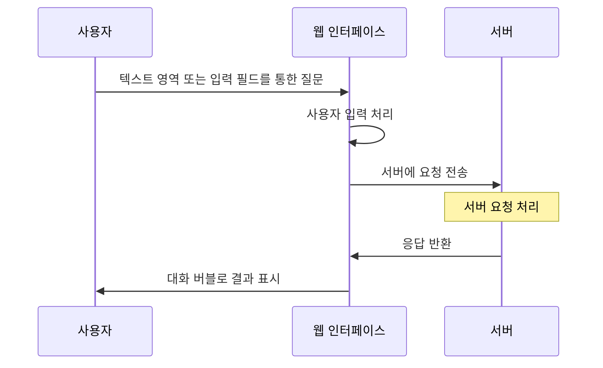

# ChatGPT 기반 경제 교육 챗봇 서비스

## 1. 소개와 기능

### 1.1 서비스 소개
- 사용자들에게 대화 형식을 통해 경제 관련 지식을 제공하는 교육 플랫폼
- 다양한 경제 관련 기사와 교육 자료를 분석하여, 사용자가 쉽고 효과적으로 경제 개념을 이해하고 학습하도록 도움

### 1.2  주요 기능
- 대화식 학습: 챗봇과의 실시간 대화를 통해 경제 개념을 학습합니다.
- 개인화된 교육 경험: 사용자의 학습 수준과 관심사에 맞춘 맞춤형 컨텐츠를 제공합니다.
- 다양한 학습 자료: 최신 경제 뉴스, 기사, 연구 자료 등을 기반으로 한 풍부한 교육 자료를 활용합니다.
- 학습 진도 추적: 사용자의 학습 진도와 성과를 추적하여 학습 효과를 극대화합니다.

## 2. 개발 환경 및 배표 URL

### 2.1 개발 환경
- 개발 환경: HTML, CSS, JavaScript
- 서비스 배포 환경: GitHub Page

### 2.2 배포 URL
- https://daisybum.github.io/orm-project1/#contact

### 2.3 URL 구조(모놀리식)
- main

| App          | URL                           | Views Function    | HTML File Name                        | Note           |
|--------------|-------------------------------|-------------------|---------------------------------------|----------------|
| orm-project1 | '/orm-project1'               | main              | /orm-project1/index.html              | 홈화면          |
| orm-project1 | '/orm-project1/tutorial       | tutorial          | /orm-project1/assets/index.html       | 튜토리얼        |

## 3. 요구사항 및 기능 명세
* 아래 일정표는 머메이드로 작성했습니다.

### 4.1 개발 일정(WBS)
* 아래 일정표는 머메이드로 작성했습니다.
