```mermaid
gantt
    dateFormat  YYYY-MM-DD
    title       챗봇을 이용한 금융 상담 웹사이트

    section 기획
    챗봇 구성                         :          des1, 2024-02-13, 3h
    말풍선 및 챗봇 레이아웃             :         des2, after des7, 1h
    각 페이지 별 구성                :         des3, 2024-02-14, 6h

    section 디자인
    리디자인                         :          des4, 2024-02-15, 6h

    section 프론트엔드 개발
    메인                             :         des7, after des1, 4h
    챗봇                             :         des8, after des1, 4h
    말풍선                           :         des9, after des2, 3h
    챗봇 레이아웃                     :         des10, after des2, 5h
    말풍선                           :         des11, 2024-02-14, 3h
    챗봇 레이아웃                     :         des12, 2024-02-14, 6h
    리디자인 반영                     :         des13, after des4, 6h

    section 백엔드 개발
    프론트엔드와 통합                 :          des13, 2024-02-15, 6h

    section 최종 조정 및 발표 준비
    웹사이트 전체 검토 및 테스트      :         des14, after des13, 3h
    마지막 조정 및 버그 수정          :         des15, after des14, 3h
    프로젝트 발표 준비                :         des16, after des15, 3h

    section 프로젝트 발표
    프로젝트 발표                     :         des17, 2024-02-16, 6h
```

# ChatGPT 기반 경제 교육 챗봇 서비스

## 1. 서비스 소개와 기능

### 1.1 서비스 소개
- 사용자들에게 대화 형식을 통해 경제 관련 지식을 제공하는 교육 플랫폼
- 다양한 경제 관련 기사와 교육 자료를 분석하여, 사용자가 쉽고 효과적으로 경제 개념을 이해하고 학습하도록 도움

### 1.2  주요 기능
- 대화식 학습: 챗봇과의 실시간 대화를 통해 경제 개념을 학습합니다.
- 개인화된 교육 경험: 사용자의 학습 수준과 관심사에 맞춘 맞춤형 컨텐츠를 제공합니다.
- 다양한 학습 자료: 최신 경제 뉴스, 기사, 연구 자료 등을 기반으로 한 풍부한 교육 자료를 활용합니다.
- 학습 진도 추적: 사용자의 학습 진도와 성과를 추적하여 학습 효과를 극대화합니다.

## 2. 개발 환경 및 배표 URL

### 2.1 개발 환경
- 개발 환경: HTML, CSS, JavaScript
- 서비스 배포 환경: GitHub Page

### 2.2 배포 URL
- https://daisybum.github.io/orm-project1/#contact

### 2.3 URL 구조(모놀리식)
- main

| App          | URL                           | Views Function    | HTML File Name                        | Note           |
|--------------|-------------------------------|-------------------|---------------------------------------|----------------|
| orm-project1 | '/orm-project1'               | main              | /orm-project1/index.html              | 홈화면          |
| orm-project1 | '/orm-project1/tutorial       | tutorial          | /orm-project1/assets/index.html       | 튜토리얼        |

## 3. 요구사항 및 기능 명세
* 아래 일정표는 머메이드로 작성했습니다.

```mermaid
sequenceDiagram
    participant U as 사용자
    participant W as 웹 인터페이스
    participant S as 서버

    U->>W: 텍스트 영역 또는 입력 필드를 통한 질문
    W->>W: 사용자 입력 처리
    W->>S: 서버에 요청 전송
    Note over S: 서버 요청 처리
    S->>W: 응답 반환
    W->>U: 대화 버블로 결과 표시
    U->>W: 추가 질문 또는 피드백
    W->>S: 추가 요청 전송
    Note over S: 추가 요청 처리
    S->>W: 추가 응답 반환
    W->>U: 대화 버블로 추가 결과 표시
```

## 4. 프로젝트 구조와 개발 일정
### 4.1 프로젝트 구조

📦orm-project1
 ┣ 📂.vscode
 ┃ ┗ 📜settings.json
 ┣ 📂aboutPage
 ┃ ┗ 📜index.html
 ┣ 📂assets
 ┃ ┣ 📂script
 ┃ ┃ ┣ 📜index.js
 ┃ ┃ ┗ 📜tutorial.js
 ┃ ┗ 📂style
 ┃ ┃ ┣ 📜about.css
 ┃ ┃ ┣ 📜main.css
 ┃ ┃ ┣ 📜normalize.css
 ┃ ┃ ┣ 📜reset.css
 ┃ ┃ ┣ 📜some.css
 ┃ ┃ ┗ 📜tutorial.css
 ┣ 📂tutorial
 ┃ ┗ 📜index.html
 ┣ 📜index.html
 ┗ 📜README.md

### 4.1 개발 일정(WBS)
* 아래 일정표는 머메이드로 작성했습니다.

