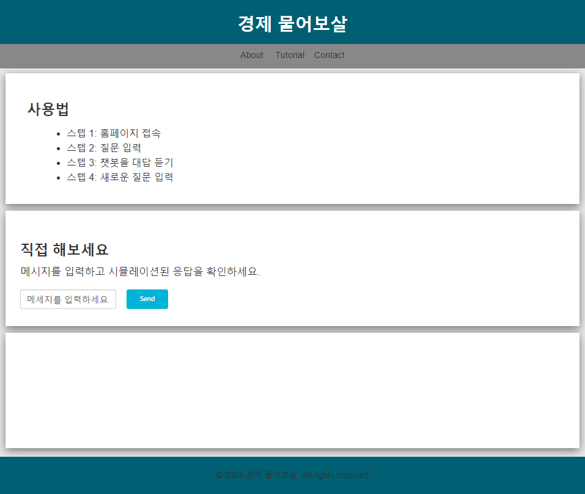

# ChatGPT 기반 경제 교육 챗봇 서비스


## 1. 서비스 소개와 기능

### 1.1 서비스 소개
- 사용자들에게 대화 형식을 통해 경제 관련 지식을 제공하는 교육 플랫폼
- 다양한 경제 관련 기사와 교육 자료를 분석하여, 사용자가 쉽고 효과적으로 경제 개념을 이해하고 학습하도록 도움

### 1.2  주요 기능
- 대화식 학습: 챗봇과의 실시간 대화를 통해 경제 개념을 학습합니다.
- 개인화된 교육 경험: 사용자의 학습 수준과 관심사에 맞춘 맞춤형 컨텐츠를 제공합니다.
- 다양한 학습 자료: 최신 경제 뉴스, 기사, 연구 자료 등을 기반으로 한 풍부한 교육 자료를 활용합니다.
- 학습 진도 추적: 사용자의 학습 진도와 성과를 추적하여 학습 효과를 극대화합니다.

## 2. 개발 환경 및 배표 URL

### 2.1 개발 환경
- 개발 환경: HTML, CSS, JavaScript
- 서비스 배포 환경: GitHub Page

### 2.2 배포 URL
- https://daisybum.github.io/orm-project1/#contact

### 2.3 URL 구조(모놀리식)
- main

| App          | URL                           | Views Function    | HTML File Name                        | Note           |
|--------------|-------------------------------|-------------------|---------------------------------------|----------------|
| orm-project1 | '/orm-project1'               | main              | /orm-project1/index.html              | 홈화면          |
| orm-project1 | '/orm-project1/tutorial       | tutorial          | /orm-project1/assets/index.html       | 튜토리얼        |

## 3. 요구사항 및 기능 명세


## 4. 프로젝트 구조와 개발 일정
### 4.1 프로젝트 구조
```
📦orm-project1
 ┣ 📂.vscode
 ┃ ┗ 📜settings.json
 ┣ 📂aboutPage
 ┃ ┗ 📜index.html
 ┣ 📂assets
 ┃ ┣ 📂script
 ┃ ┃ ┣ 📜index.js
 ┃ ┃ ┗ 📜tutorial.js
 ┃ ┗ 📂style
 ┃ ┃ ┣ 📜about.css
 ┃ ┃ ┣ 📜main.css
 ┃ ┃ ┣ 📜normalize.css
 ┃ ┃ ┣ 📜reset.css
 ┃ ┃ ┗ 📜tutorial.css
 ┣ 📂tutorial
 ┃ ┗ 📜index.html
 ┣ 📜index.html
 ┗ 📜README.md
```

### 4.2 개발 일정(WBS)
* 아래 일정표는 머메이드로 작성했습니다.


## 5. 와이어프레임 / UI / BM

### 5.1 와이어프레임

<br></br>

<br></br>


- 와이어 프레임은 디자인을 할 수 있다면 '피그마'를, 디자인을 할 수 없다면 '카카오 오븐'으로 쉽게 만들 수 있습니다.

## 6. 에러 및 해결방법

### 6.1 단락 줄바꿈 에러
- 챗GPT의 답변을 말풍선으로 출력할 때, 단락마다 줄바꿈이 이루어지지 않는 문제
    - 기존 코드:  ChatGPT의 응답을 받을 때, textContent 속성을 사용해서 텍스트를 추가함
        - textContent는 HTML 태그를 무시하고 순수한 텍스트만을 다룸
    - 해결책: textContent 대신, innerHTML을 이용하여 텍스트를 추가
        - innerHTML은 HTML 태그를 인식하므로 줄바꿈을 인식할 수 있음
- 문제 해결 실패
    - 챗GPT의 응답과 파싱 과정의 분석 필요
